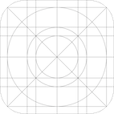
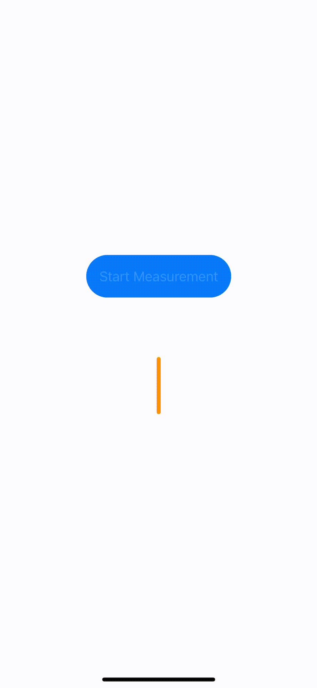
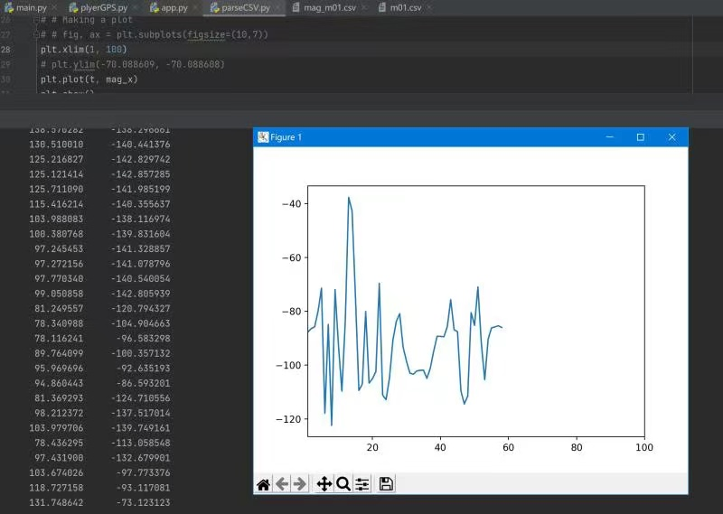
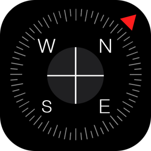
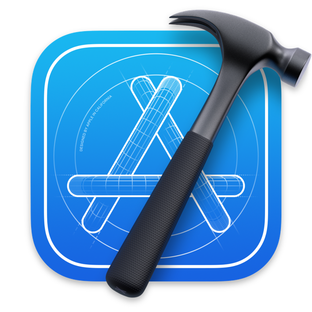
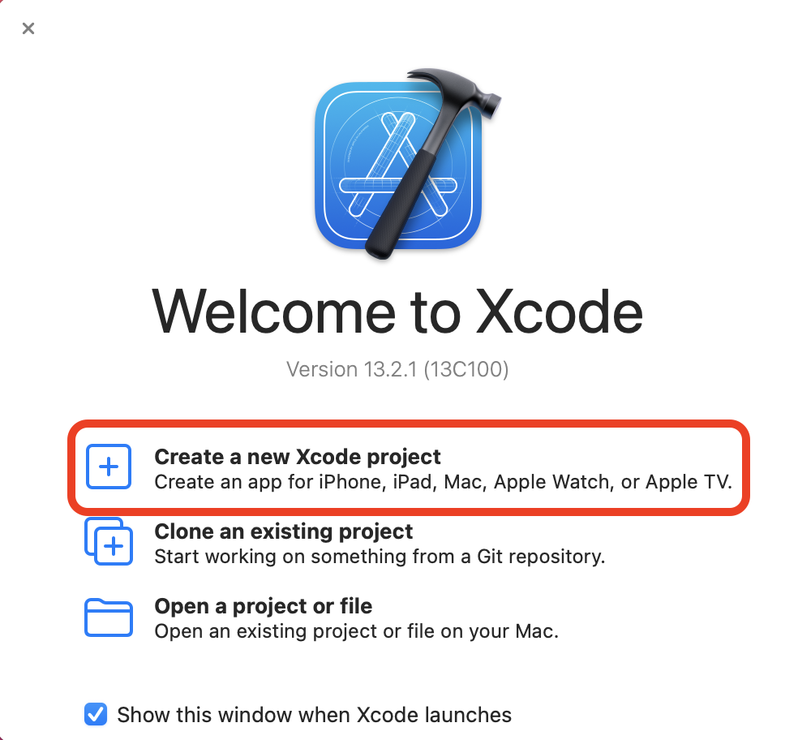
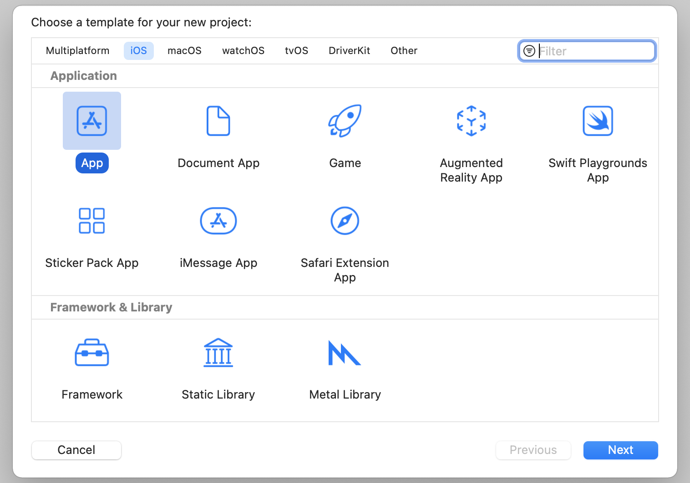
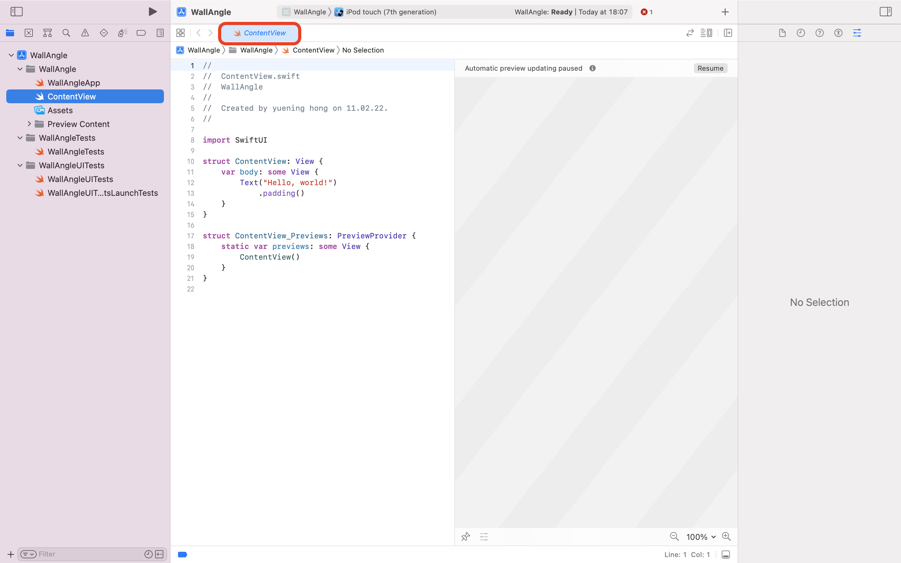

# Protoyping-Project_WallAngle
<div id="top"></div>


<!-- PROJECT SHIELDS -->
<!--
*** I'm using markdown "reference style" links for readability.
*** Reference links are enclosed in brackets [ ] instead of parentheses ( ).
*** See the bottom of this document for the declaration of the reference variables
*** for contributors-url, forks-url, etc. This is an optional, concise syntax you may use.
*** https://www.markdownguide.org/basic-syntax/#reference-style-links
-->

[![YouTube][youtube-shield]][youtube-url]

<!-- PROJECT LOGO -->
<br />
<div align="center">
  <a href="https://github.com/Ferkelcode/Protoyping-Project_WallAngle">
    
  </a>


  
  <p align="center">
    This is the App that I made for the Prototyping Project, it can be used to measure the angle between two walls.
    <br />
    <a href="https://github.com/Ferkelcode/Protoyping-Project_WallAngle"><strong>Explore the docs »</strong></a>
    <br />
    <br />
    <a href="https://github.com/Ferkelcode/Protoyping-Project_WallAngle">View Demo</a>
    ·
    <a href="https://github.com/Ferkelcode/Protoyping-Project_WallAngle">Report Bug</a>
    ·
    <a href="https://github.com/Ferkelcode/Protoyping-Project_WallAngle">Request Feature</a>
  </p>
</div>


<!-- PROJECT SCREEN -->
<br />
<div align="center">
  <a href="https://github.com/Ferkelcode/Protoyping-Project_WallAngle">
    <kbd></kbd>
  </a>
  </p>
</div>
  
<!-- TABLE OF CONTENTS -->
<details>
  <summary>Table of Contents</summary>
  <ol>
    <li>
      <a href="#about-the-project">About The Project</a>
      <ul>
        <li><a href="#built-with">Built With</a></li>
      </ul>
    </li>
    <li>
      <a href="#getting-started">Getting Started</a>
      <ul>
        <li><a href="#prerequisites">Prerequisites</a></li>
        <li><a href="#build-the-wallangle-app">Build the WallAngle App</a></li>
      </ul>
    </li>
    <li><a href="#usage">Usage</a></li>
    <li><a href="#project-roadmap">Project Roadmap</a></li>
    <li><a href="#contributing">Contributing</a></li>
    <li><a href="#contact">Contact</a></li>
    <li><a href="#acknowledgments">Acknowledgments</a></li>
  </ol>
</details>

<!-- ABOUT THE PROJECT -->
## About The Project


With this App, you can measure the angle without searching for tools and calculations. From [phyphox](https://phyphox.org/), I have learned that the sensors in my phone can be used to do a lot. For example, [gyroscope](https://en.wikipedia.org/wiki/Gyroscope) is used for measuring or maintaining orientation and angular velocity. [Magnetometers](https://en.wikipedia.org/wiki/Magnetometer) can be used for measuring the strength and sometimes the direction of magnetic fields, including those on or near the Earth and in space. Magnetometers are also used to calibrate electromagnets and permanent magnets and to determine the magnetization of materials. 
So we want to export these data from the phone, and analyse them.


<br />
<div align="center">
  <a href="https://github.com/Ferkelcode/Protoyping-Project_WallAngle">
    
  </a>
  </p>
</div>
<br />
<div align="center">
  <a href="https://github.com/Ferkelcode/Protoyping-Project_WallAngle">
    
  </a>
  </p>
</div>

<p align="right">(<a href="#top">back to top</a>)</p>


### Built With
This section includes major frameworks/libraries used in my project. <br /> 
*There are some helpful tutorials can be found in the <a href="#Acknowledgments">Acknowledgements</a>  section.  <br /> 
Some of useful libraries and tools that are not used in this final App, are also documented in the <a href="#Roadmap">Roadmap</a>  section.*

* [SwiftUI](https://developer.apple.com/xcode/swiftui/)
* [Xcode](https://developer.apple.com/xcode/)
* [Kivy](https://kivy.org/#home)
* [kivy-ios](https://github.com/kivy/kivy-ios)
* [Pyobjus on iOS](https://pyobjus.readthedocs.io/en/latest/pyobjus_ios.html)
* [socketserver](https://docs.python.org/3/library/socketserver.html)


<p align="right">(<a href="#top">back to top</a>)</p>


<!-- GETTING STARTED -->
## Getting Started
This post is mostly about the SwiftUI side of the measurement function. The main part of this tutorial will be <br /> 

- [x] Getting the rotations and padding correct
- [x] Having the testing processes correct
- [x] Giving an `alert` and blocking with `UIDeviceOrientation` when the phone is not being hold horizontally
- [x] Implement the App on your iphone :tada:


### Prerequisites

1. Having your iphone with magnetometer sensor working well, you can check with your Compass app  to see if the results are acceptable.
2. Create an [Apple Developer](https://developer.apple.com/programs/enroll/) account 


### Build the WallAngle App

1. Install Xcode  from [App Store](https://apps.apple.com/us/app/xcode/id497799835?mt=12), it takes longer than installing other Apps.
2. Create a new Xcode Project
<div align="">
  <a href="https://github.com/Ferkelcode/Protoyping-Project_WallAngle">
    <kbd></kbd>
  </a>
  </p>
</div>

3. Choose a template for `App`

<div align="">
  <a href="https://github.com/Ferkelcode/Protoyping-Project_WallAngle">
    <kbd></kbd>
  </a>
  </p>
</div>

4. Then you will have an empty tempalte for your App with `ContentView`

<div align="">
  <a href="https://github.com/Ferkelcode/Protoyping-Project_WallAngle">
    <kbd></kbd>
  </a>
  </p>
</div>


```

import SwiftUI

struct ContentView: View {
    var body: some View {
        Text("Hello, world!")
            .padding()
    }
}

struct ContentView_Previews: PreviewProvider {
    static var previews: some View {
        ContentView()
    }
}

```

5. Replace the above code with my `ContentView` [code](https://github.com/Ferkelcode/Protoyping-Project_WallAngle/blob/main/WallAngle2.0/WallAngle/ContentView.swift). Explanations are comments in between the codes.


:hammer_and_wrench: `Capsule`
I use [Capsule](https://developer.apple.com/documentation/swiftui/capsule) view to show direction where my phone is facing. 

```
                Capsule()
                    .frame(width: 5, height: 70)
                    .foregroundColor(.orange)
```

:hammer_and_wrench: `rotationEffect(_:anchor:)`
The `rotationEffect` will rotate the second `Capsule` so that the marker view is at the correct angle.
```
                    Capsule()
                        .frame(width: 5, height: 70)
                        .foregroundColor(.blue)
                        .rotationEffect(SwiftUI.Angle(degrees: self.compassHeading.degrees-Wall1), anchor: .bottom)
```


:hammer_and_wrench: `magneticHeading`
[Core Location](https://developer.apple.com/documentation/corelocation) provides services that determine a device’s geographic location, altitude, and orientation, or its position relative to a nearby iBeacon device. The framework gathers data using all available components on the device, including the Wi-Fi, GPS, Bluetooth, magnetometer, barometer, and cellular hardware.

[magneticHeading](https://developer.apple.com/documentation/corelocation/clheading/1423763-magneticheading) is used to measure the heading (measured in degrees) relative to magnetic north. 

We need to create a new file called CompassHeading.swift and write the following [code](https://github.com/Ferkelcode/Protoyping-Project_WallAngle/blob/main/WallAngle2.0/WallAngle/CompassHeading.swift) to it:


```
import Foundation
import Combine
import CoreLocation

class CompassHeading: NSObject, ObservableObject, CLLocationManagerDelegate {
    var objectWillChange = PassthroughSubject<Void, Never>()
    var degrees: Double = .zero {
        didSet {
            objectWillChange.send()
        }
    }
    
    private let locationManager: CLLocationManager
    
    override init() {
        self.locationManager = CLLocationManager()
        super.init()
        
        self.locationManager.delegate = self
        self.setup()
    }
    
    private func setup() {
        self.locationManager.requestWhenInUseAuthorization()
        
        if CLLocationManager.headingAvailable() {
            self.locationManager.startUpdatingLocation()
            self.locationManager.startUpdatingHeading()
        }
    }
    
    func locationManager(_ manager: CLLocationManager, didUpdateHeading newHeading: CLHeading) {
        self.degrees = -1 * newHeading.magneticHeading
    }
}
```


:hammer_and_wrench: `UIDeviceOrientation`


:hammer_and_wrench: `Layout Containers`


<p align="right">(<a href="#top">back to top</a>)</p>


<!-- USAGE EXAMPLES -->
## Usage

When using this app, you should keep holding the phone HORIZONTALLY, otherwise the measurement function will be blocked by `UIDeviceOrientation`.
Try to use the top side of the phone to touch the wall surfaces, as there is no buttons which might cause inaccuarcy.

_For more details, please refer to the [Video](https://google.com)_

<p align="right">(<a href="#top">back to top</a>)</p>


<!-- ROADMAP -->
## Project Roadmap
<a id="Roadmap">   </a>
- [x] KivyApp
- [x] Built with SwiftUI, without the alert information and the blocking functions to ensure the phone is holding horizontally
- [x] Adding alert information and the blocking functions to ensure the phone is holding horizontally
- [x] Adding a colored bar to show the user to touch the wall surfaces with the top side of the phone, so that the results will not be affected by the button
- [ ] Communications
- [ ] ...

See the [open issues](https://github.com/Ferkelcode/Protoyping-Project_WallAngle) for a full list of proposed features (and known issues).

<p align="right">(<a href="#top">back to top</a>)</p>


<!-- CONTRIBUTING -->
## Contributing

Contributions are what make the open source community such an amazing place to learn, inspire, and create. Any contributions you make are **greatly appreciated**.

If you have a suggestion that would make this better, please fork the repo and create a pull request. You can also simply open an issue with the tag "enhancement".
Don't forget to give the project a star! Thanks again!

1. Fork the Project
2. Create your Feature Branch (`git checkout -b feature/AmazingFeature`)
3. Commit your Changes (`git commit -m 'Add some AmazingFeature'`)
4. Push to the Branch (`git push origin feature/AmazingFeature`)
5. Open a Pull Request

<p align="right">(<a href="#top">back to top</a>)</p>


<!-- CONTACT -->
## Contact

Yuening Hong - yuening.hong@rwth-aachen.de

Project Link: [https://github.com/Ferkelcode/Protoyping-Project_WallAngle](https://github.com/Ferkelcode/Protoyping-Project_WallAngle)

<p align="right">(<a href="#top">back to top</a>)</p>


<!-- ACKNOWLEDGMENTS -->
## Acknowledgments
<a id="Acknowledgments">   </a>
* **Supervisors**: :bouquet: [Christoph Heuer](https://www.ip.rwth-aachen.de/staff/) & :bouquet: [Carsten Kamp](https://www.ip.rwth-aachen.de/staff/)
* [phyphox – Physical Phone Experiments](https://phyphox.org/)
* [Introducing SwiftUI](https://developer.apple.com/tutorials/swiftui)
* [How to detect device rotation](https://www.hackingwithswift.com/quick-start/swiftui/how-to-detect-device-rotation)
* [Apple Developer Documentation](https://developer.apple.com/documentation/technologies)
* [Build a Compass app with SwiftUI](https://medium.com/@darrenleak1/build-a-compass-app-with-swiftui-f9b7faa78098)
* [Best-README-Template](https://github.com/othneildrew/Best-README-Template)
* [emoji-cheat-sheet](https://github.com/ikatyang/emoji-cheat-sheet/blob/master/README.md)
* [Basic writing and formatting syntax](https://docs.github.com/en/get-started/writing-on-github/getting-started-with-writing-and-formatting-on-github/basic-writing-and-formatting-syntax)

<p align="right">(<a href="#top">back to top</a>)</p>


<!-- MARKDOWN LINKS & IMAGES -->
<!-- https://www.markdownguide.org/basic-syntax/#reference-style-links -->
[youtube-shield]: https://img.shields.io/youtube/views/7W39tZhf4vc?color=%23ff0000&label=Watch
[youtube-url]: https://youtu.be/7W39tZhf4vc

