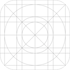
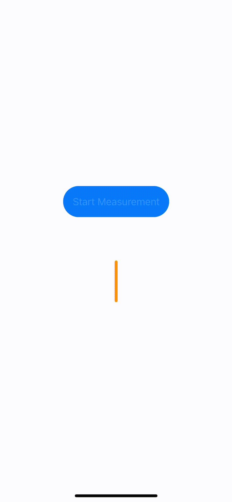

# Protyping-Project_WallAngle
<div id="top"></div>


<!-- PROJECT SHIELDS -->
<!--
*** I'm using markdown "reference style" links for readability.
*** Reference links are enclosed in brackets [ ] instead of parentheses ( ).
*** See the bottom of this document for the declaration of the reference variables
*** for contributors-url, forks-url, etc. This is an optional, concise syntax you may use.
*** https://www.markdownguide.org/basic-syntax/#reference-style-links
-->

[![YouTube][youtube-shield]][youtube-url]

<!-- PROJECT LOGO -->
<br />
<div align="center">
  <a href="https://github.com/Ferkelcode/Protyping-Project_WallAngle">
    
  </a>


  
  <p align="center">
    This is the App that I made for the Prototyping Project, it can be used to measure the angle between two walls.
    <br />
    <a href="https://github.com/Ferkelcode/Protyping-Project_WallAngle"><strong>Explore the docs »</strong></a>
    <br />
    <br />
    <a href="https://github.com/Ferkelcode/Protyping-Project_WallAngle">View Demo</a>
    ·
    <a href="https://github.com/Ferkelcode/Protyping-Project_WallAngle">Report Bug</a>
    ·
    <a href="https://github.com/Ferkelcode/Protyping-Project_WallAngle">Request Feature</a>
  </p>
</div>


<!-- PROJECT SCREEN -->
<br />
<div align="center">
  <a href="https://github.com/Ferkelcode/Protyping-Project_WallAngle">
    
  </a>
  </p>
</div>
  
<!-- TABLE OF CONTENTS -->
<details>
  <summary>Table of Contents</summary>
  <ol>
    <li>
      <a href="#about-the-project">About The Project</a>
      <ul>
        <li><a href="#built-with">Built With</a></li>
      </ul>
    </li>
    <li>
      <a href="#getting-started">Getting Started</a>
      <ul>
        <li><a href="#prerequisites">Prerequisites</a></li>
        <li><a href="#installation">Installation</a></li>
      </ul>
    </li>
    <li><a href="#usage">Usage</a></li>
    <li><a href="#roadmap">Roadmap</a></li>
    <li><a href="#contributing">Contributing</a></li>
    <li><a href="#license">License</a></li>
    <li><a href="#contact">Contact</a></li>
    <li><a href="#acknowledgments">Acknowledgments</a></li>
  </ol>
</details>

<!-- ABOUT THE PROJECT -->
## About The Project


With this App, you can measure the angle without searching for tools and calculations. From [phyphox](https://phyphox.org/), I have learned that the sensors in my phone can be used to do a lot.For example, [magnetometers](https://en.wikipedia.org/wiki/Magnetometer) can be used for measuring the strength and sometimes the direction of magnetic fields, including those on or near the Earth and in space. Magnetometers are also used to calibrate electromagnets and permanent magnets and to determine the magnetization of materials.

<p align="right">(<a href="#top">back to top</a>)</p>


### Built With

* [SwiftUI](https://developer.apple.com/xcode/swiftui/)
* [Xcode](https://developer.apple.com/xcode/)


<p align="right">(<a href="#top">back to top</a>)</p>


<!-- GETTING STARTED -->
## Getting Started

I

### Prerequisites

This is an example of how to list things you need to use the software and how to install them.
* npm
  ```sh
  npm install npm@latest -g
  ```

### Installation

1. Get a free API Key at [https://example.com](https://example.com)
2. Clone the repo
   ```sh
   git clone https://github.com/github_username/repo_name.git
   ```
3. Install NPM packages
   ```sh
   npm install
   ```
4. Enter your API in `config.js`
   ```js
   const API_KEY = 'ENTER YOUR API';
   ```

<p align="right">(<a href="#top">back to top</a>)</p>


<!-- USAGE EXAMPLES -->
## Usage

Use this space to show useful examples of how a project can be used. Additional screenshots, code examples and demos work well in this space. You may also link to more resources.

_For more examples, please refer to the [Documentation](https://example.com)_

<p align="right">(<a href="#top">back to top</a>)</p>


<!-- ROADMAP -->
## Roadmap

- [ ] Feature 1
- [ ] Feature 2
- [ ] Feature 3
    - [ ] Nested Feature

See the [open issues](https://github.com/github_username/repo_name/issues) for a full list of proposed features (and known issues).

<p align="right">(<a href="#top">back to top</a>)</p>


<!-- CONTRIBUTING -->
## Contributing

Contributions are what make the open source community such an amazing place to learn, inspire, and create. Any contributions you make are **greatly appreciated**.

If you have a suggestion that would make this better, please fork the repo and create a pull request. You can also simply open an issue with the tag "enhancement".
Don't forget to give the project a star! Thanks again!

1. Fork the Project
2. Create your Feature Branch (`git checkout -b feature/AmazingFeature`)
3. Commit your Changes (`git commit -m 'Add some AmazingFeature'`)
4. Push to the Branch (`git push origin feature/AmazingFeature`)
5. Open a Pull Request

<p align="right">(<a href="#top">back to top</a>)</p>


<!-- LICENSE -->
## License

Distributed under the MIT License. See `LICENSE.txt` for more information.

<p align="right">(<a href="#top">back to top</a>)</p>


<!-- CONTACT -->
## Contact

Your Name - [@twitter_handle](https://twitter.com/twitter_handle) - email@email_client.com

Project Link: [https://github.com/github_username/repo_name](https://github.com/github_username/repo_name)

<p align="right">(<a href="#top">back to top</a>)</p>


<!-- ACKNOWLEDGMENTS -->
## Acknowledgments

* []()
* []()
* []()

<p align="right">(<a href="#top">back to top</a>)</p>


<!-- MARKDOWN LINKS & IMAGES -->
<!-- https://www.markdownguide.org/basic-syntax/#reference-style-links -->
[youtube-shield]: https://img.shields.io/youtube/views/7W39tZhf4vc?color=%23ff0000&label=Watch
[youtube-url]: https://youtu.be/7W39tZhf4vc

